| | |
|---|---|
| **Nombre** | Nicolás Cavieres |
| **Carrera** | Analista Programador |
| **Fecha** | 14/09/2026 |
| **Profesor** | Alonso Castillo |
| **Curso** | Backend III |

---

# Banco XYZ — Arquitectura Backend for Frontend (BFF)

Implementación del patrón **Backend for Frontend (BFF)** para el sistema bancario simulado **Banco XYZ**, a partir de los datos legacy de [bank_legacy_data](https://github.com/KariVillagran/bank_legacy_data).

El sistema expone un backend especializado por cada tipo de cliente (**Web**, **Móvil** y **Cajeros Automáticos**), con **HTTPS**, **autenticación y autorización específicas por canal** (JWT), y un proceso **Spring Batch** que limpia y carga los datos legacy (CSV) en **MySQL**.

---

## 1. Arquitectura

```
 Archivos CSV (bank_legacy_data)
        │
        ▼
  banco-batch (Spring Batch)  ➜  limpia y carga datos (retry/skip)
        │
        ▼
      MySQL 8.4  (banco_xyz)
        │
        ▼
  backend-core  ➜  reglas de negocio + acceso a datos (JPA, resource server JWT)
        │ RestClient (HTTPS + relay de token JWT)
   ┌────┴────┬──────────┐
   ▼         ▼          ▼
 bff-web   bff-mobile  bff-atm
 (HTTPS)    (HTTPS)    (HTTPS)
   │         │          │
Cliente    Cliente    Cajero
 Web        Mobile      ATM
```

Los **BFFs no acceden directamente a la base de datos**: consumen `backend-core` mediante HTTPS, reenviando el token JWT del cliente (token relay). El entorno completo se despliega con **Docker Compose** (un solo comando).

---

## 2. Responsabilidades

| Componente | Puerto | Protocolo | Responsabilidad |
|---|---|---|---|
| `banco-batch` | 8080 | HTTP (interno) | Lee los CSV, limpia datos (validación + deduplicación) y los persiste en MySQL |
| `backend-core` | 8081 | HTTPS | Lógica de negocio y acceso a datos; valida JWT; el retiro requiere `ROLE_ATM` |
| `bff-web` | 8082 | HTTPS | Datos completos + resumen para navegadores |
| `bff-mobile` | 8083 | HTTPS | Respuestas ligeras + últimos 5 movimientos |
| `bff-atm` | 8084 | HTTPS | Operaciones críticas: consulta de saldo y retiro |
| MySQL | 3307 | — | Persistencia (`banco_xyz`) |

---

## 3. Seguridad de auth

- **HTTPS/TLS** activo en `backend-core` y en los 3 BFFs (certificado autofirmado incluido en el proyecto).
- **Autenticación por canal**: cada BFF expone `POST /api/auth/login` y emite un **JWT (HS256)** firmado con un secreto compartido.
- **Autorización por canal**: cada BFF exige el rol de su canal en sus endpoints; `backend-core` valida el JWT y restringe el retiro a `ROLE_ATM`.

### Usuarios de prueba (por canal)

| Canal | Usuario | Contraseña | Rol |
|---|---|---|---|
| Web | `web.admin` | `WebPass123!` | `ROLE_WEB` |
| Mobile | `mobile.user` | `MobilePass123!` | `ROLE_MOBILE` |
| ATM | `atm.terminal` | `AtmPass123!` | `ROLE_ATM` |

### Verificación de la autorización

| Prueba | Resultado esperado |
|---|---|
| Sin token → endpoint protegido | `401` |
| Token Web → endpoint Mobile/ATM | `403` |
| Token Mobile → endpoint ATM | `403` |
| Token Web → retiro en core | `403` (requiere `ROLE_ATM`) |
| Login con contraseña incorrecta | `401` |

---

## 4. Estructura de proyecto

```
S3_Bank_BFF/
├── pom.xml                     # Módulo padre (agregador Maven)
├── docker-compose.yml          # Orquestación completa (BD + 5 servicios)
├── keystore.p12                # Certificado autofirmado (HTTPS en desarrollo)
├── common/                     # Librería compartida: JWT, seguridad, cliente SSL, DTOs
├── backend-core/               # Reglas de negocio + JPA + resource server JWT
├── banco-batch/                # Spring Batch (limpieza y carga de datos)
├── bff-web/                    # BFF canal Web
├── bff-mobile/                 # BFF canal Móvil
├── bff-atm/                    # BFF canal Cajeros Automáticos
├── postman/                    # Colección Postman para pruebas
├── imgs/                       # Evidencias de ejecución (informe)
└── scripts/
    ├── deploy.sh               # Despliegue completo con Docker
    ├── evidencia.sh            # Generación de evidencia por línea de comandos
    └── generar_imagenes.py     # Generador de imágenes del informe
```

---

## 5. Tecnologías y requisitos previos

### Tecnologías

- **Java 21**, **Spring Boot 3.3.5**, Maven.
- **Spring Web / MVC** (REST), **Spring Data JPA** (backend-core), **Spring Batch** (banco-batch).
- **Spring Security + OAuth2 Resource Server (JWT)** con **Nimbus JOSE+JWT**.
- **MySQL 8.4** (Docker), `JdbcTemplate` (escritura idempotente del batch), `RestClient` (BFF → core).
- **HTTPS/TLS** con certificado autofirmado (PKCS12).

### Requisitos previos

- **Docker** + **Docker Compose** (con BuildKit habilitado opcional; el despliegue también funciona con el builder por defecto).
- Postman (para las pruebas — ver sección 8).

> Java y Maven solo son necesarios si se desea compilar fuera de Docker; el despliegue con `docker compose` compila dentro de los contenedores.

---

## 6. Puesta en marcha

El despliegue completo (MySQL + proceso batch + backend-core + los 3 BFFs) se realiza con un solo comando:

```bash
./scripts/deploy.sh
```

Equivale a:

```bash
docker compose up -d --build
```

Este comando construye las imágenes de los 5 servicios y levanta todo. Al terminar:

```bash
docker compose ps          # estado de los contenedores
docker logs banco-bff-batch   # verificar la carga de datos (estado COMPLETED)
```

| Contenedor | Servicio | Puerto |
|---|---|---|
| `banco-xyz-mysql` | MySQL 8.4 | 3307 |
| `banco-bff-batch` | Proceso batch (carga datos al arrancar) | 8080 |
| `banco-bff-core` | Backend Core | 8081 (HTTPS) |
| `banco-bff-web` | BFF Web | 8082 (HTTPS) |
| `banco-bff-mobile` | BFF Mobile | 8083 (HTTPS) |
| `banco-bff-atm` | BFF ATM | 8084 (HTTPS) |

Detener el entorno:

```bash
docker compose down       # conserva los datos en el volumen
docker compose down -v    # también borra el volumen de datos
```

---

## 7. Carga de datos

El proceso batch (`banco-batch`) lee los CSV de `bank_legacy_data`, los **limpia** y los **persiste** en MySQL:

- **Al arrancar automáticamente**: en Docker, `BATCH_RUN_ON_STARTUP=true` ejecuta el job al iniciar el contenedor.
- **De forma manual**: `GET http://localhost:8080/api/batch/procesar`.

Respuesta de ejemplo:

```json
{ "jobId": 1, "estado": "COMPLETED", "leidos": 3000, "escritos": 1711, "omitidos": 1289 }
```

### Reglas de limpieza

- **Fechas**: normaliza formatos `yyyy-MM-dd`, `yyyy/MM/dd`, `dd-MM-yyyy`, `dd/MM/yyyy`.
- **Montos**: descarta vacíos, cero y negativos; normaliza el signo según el tipo.
- **Edades**: descarta valores fuera de `[0, 120]`.
- **Tipos**: normaliza acentos y descarta tipos desconocidos.
- **Duplicados**: omitidos por clave única (`INSERT IGNORE`), con `skip` para registros inválidos y `retry` para fallas transitorias.

---

## 8. Uso de la colección Postman

La colección está en `postman/Banco_XYZ_BFF.postman_collection.json`.

1. **Importar**: Postman → *Import* → seleccionar el archivo.
2. **Configurar SSL**: como los servicios usan HTTPS con certificado autofirmado, desactivar la verificación: *Settings → General → SSL certificate verification → OFF*.
3. **Ejecutar en orden**:
   - `1 - Auth` → ejecutar los **3 login** (guardan `web_token`, `mobile_token`, `atm_token` automáticamente).
   - `2 - Backend Core`, `3 - BFF Web`, `4 - BFF Mobile`, `5 - BFF ATM`.

| Carpeta | Acción |
|---|---|
| `1 - Auth` | Login de los 3 canales (guarda tokens) |
| `2 - Backend Core` | Cuentas, transacciones, movimientos y retiro |
| `3 - BFF Web` | Datos completos + resumen |
| `4 - BFF Mobile` | Datos ligeros (últimos 5 movimientos) |
| `5 - BFF ATM` | Consulta de saldo y retiro |

> Guía detallada de ejecución y pruebas en [`POSTMAN.md`](POSTMAN.md).

---

## 9. Informe con la evidencia del proceso corriendo

A continuación se muestran las evidencias de la ejecución del sistema (capturas propias en la carpeta [`imgs/`](imgs/)).

### 9.1 Contenedores corriendo

Los 6 contenedores del stack levantados con `docker compose up -d --build` (MySQL healthy, proceso batch, backend-core y los 3 BFFs).

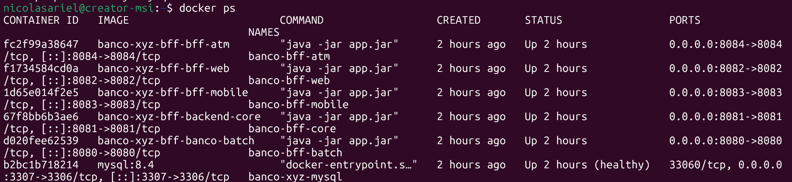

### 9.2 Autenticación por canal (login)

Cada BFF emite su propio JWT con el rol del canal correspondiente.

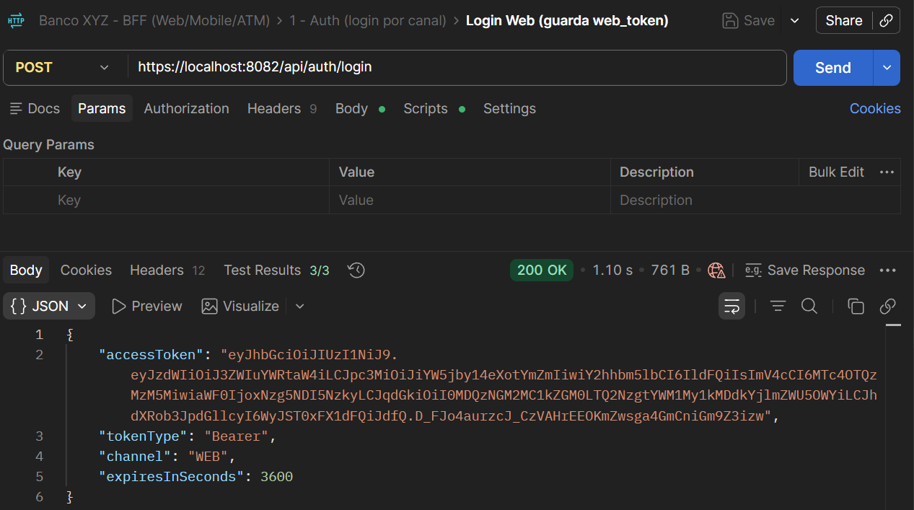

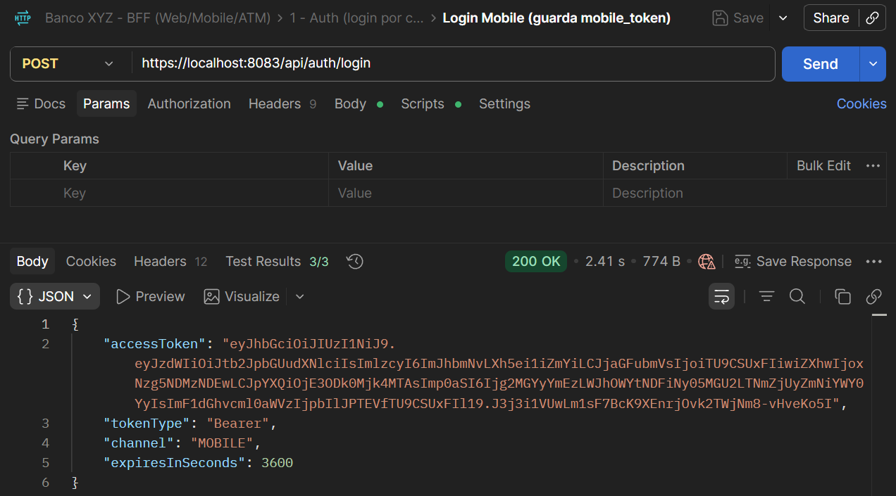

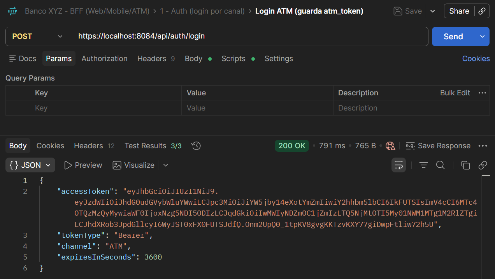

### 9.3 Carga de datos (Spring Batch)

Disparo del proceso batch desde Postman; el job finaliza en estado `COMPLETED` cargando los datos limpios en MySQL.

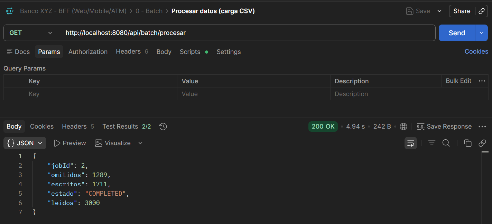

### 9.4 Backend Core

`backend-core`: listado de cuentas (acceso a los datos limpios).

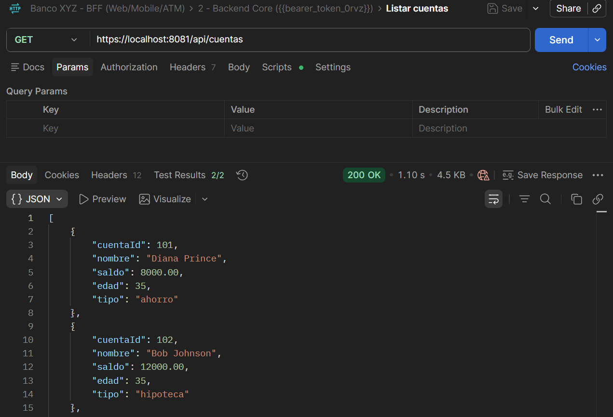

### 9.5 BFF Web

Datos completos del canal Web: listado de cuentas y detalle de cuenta con movimientos y resumen.

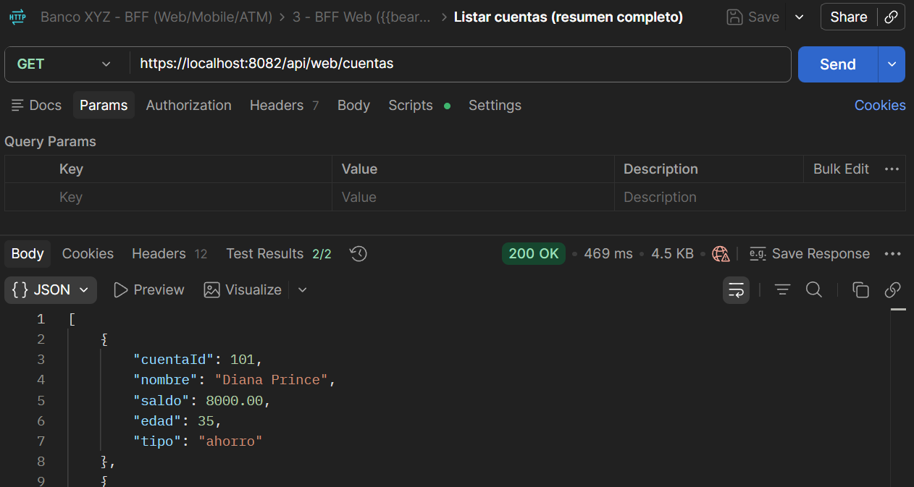

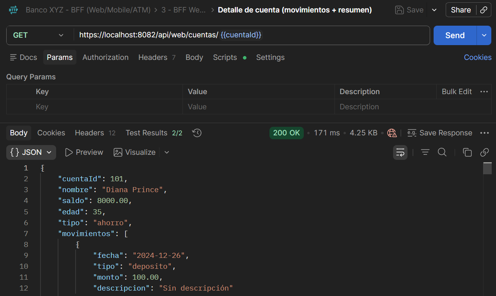

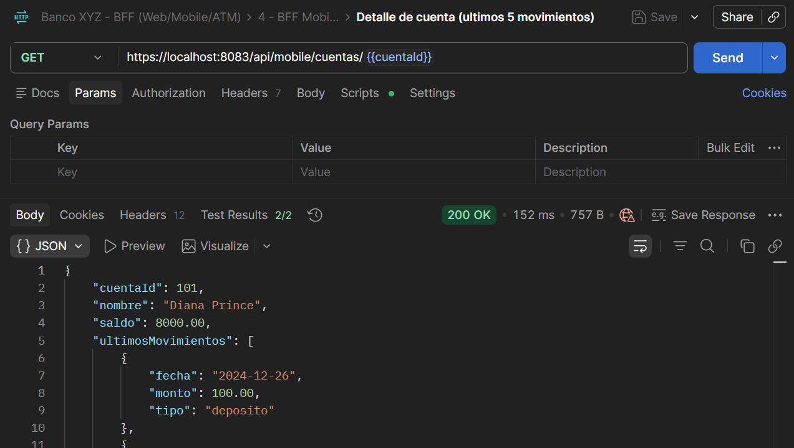

### 9.6 BFF Mobile

Canal Mobile: listado de cuentas con datos ligeros (se reduce el consumo de ancho de banda).

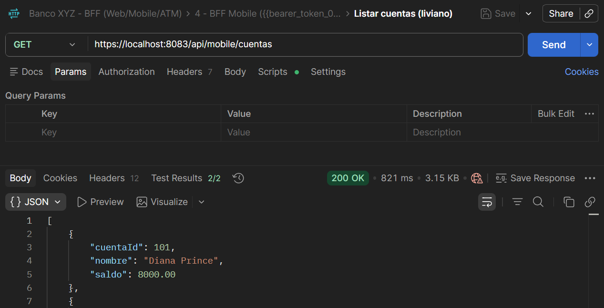

### 9.7 BFF ATM

Canal ATM: consulta de saldo y retiro (operaciones críticas del cajero automático).

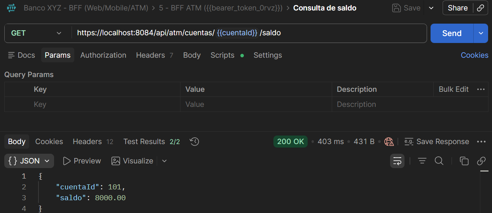

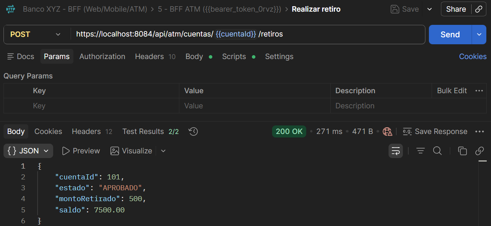